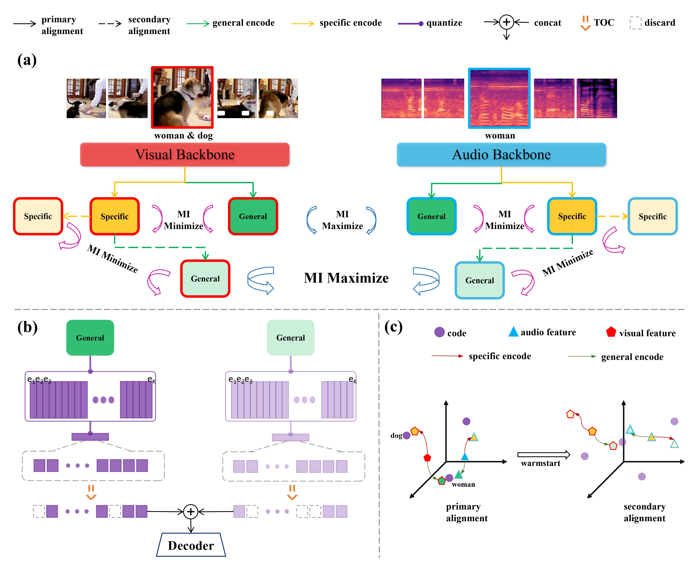

# Unlocking the Potential of Multimodal Unified Discrete Representation through Training-Free Codebook Optimization and Hierarchical Alignment




This is the Pytorch implementation of our paper:

Unlocking the Potential of Multimodal Unified Discrete Representation through Training-Free Codebook Optimization and Hierarchical Alignment

[Hai Huang](https://scholar.google.com/citations?user=FKvBzQwAAAAJ), 
[Yan Xia](https://scholar.google.com/citations?user=6kEbV3IAAAAJ&hl), 
[Shengpeng Ji](https://scholar.google.com/citations?user=zuRaB-oAAAAJ),
[Shulei Wang](),
[Hanting Wang](),
[Jieming Zhu](https://scholar.google.com/citations?user=oNKerP8AAAAJ),
[Zhenhua Dong](https://scholar.google.com/citations?user=JeePtHEAAAAJ),
[Zhou Zhao](https://scholar.google.com.hk/citations?user=IIoFY90AAAAJ)

------

### 📝Requirements and Installation

- ##### Getting Started

```python
git clone https://github.com/haihuangcode/TOC_H-DCID
cd TOC_H-DCID
# You don't actually have to install all the libraries in the txt file, you can choose to install them as needed.
# It is recommended to use Python 3.7, as some libraries used do not support higher versions of Python.
conda create -n your_env_name python=3.7
pip install -r requirements.txt
```

- ##### Pretrain
```python
cd TOC_H-DCID/code/src
./pretrain.sh
```

- ##### AVE_downstream
```python
cd TOC_H-DCID/code/src
./ave.sh
```

- ##### AVVP_downstream
```python
cd TOC_H-DCID/code/src
./avvp.sh
```

- ##### AVE_AVVP_downstream
```python
cd TOC_H-DCID/code/src
./ave_avvp.sh
```

- ##### UCF_VGGSOUND_downstream
```python
cd TOC_H-DCID/code/src
./ucf_vggsound.sh
```

<!-- - ##### AVS_downstream
```python
cd TOC_H-DCID/code/AVSBench_downstream/avs_scripts/avs_s4
./train.sh
./test.sh
``` -->

## 🎓Cite

If you find this work useful, please consider citing it.

```
@article{xia2024achieving,
  title={Achieving Cross Modal Generalization with Multimodal Unified Representation},
  author={Xia, Yan and Huang, Hai and Zhu, Jieming and Zhao, Zhou},
  journal={Advances in Neural Information Processing Systems},
  volume={36},
  year={2024}
}
@article{huang2024unlocking,
  title={Unlocking the Potential of Multimodal Unified Discrete Representation through Training-Free Codebook Optimization and Hierarchical Alignment},
  author={Huang, Hai and Xia, Yan and Ji, Shengpeng and Wang, Shulei and Wang, Hanting and Zhu, Jieming and Dong, Zhenhua and Zhao, Zhou},
  journal={arXiv preprint arXiv:2403.05168},
  year={2024}
}
```

## ✏Model Checkpoints And Date Feature
[DCID & Date Feature](https://pan.baidu.com/s/1CTcjMHVeG-8uo4HPWNNL9Q ) (pwd: 1234)
[H-DCID](https://pan.baidu.com/s/1nQCQCxC3jhJrRGuELQ0fFQ?pwd=1234 ) (pwd: 1234)

## ✏Directory

```
TOC_H-DCID
├── checkpoint
├── cnt.pkl
├── code
├── data
├── figs
├── README.md
└── requirements.txt
```

## ✏Note
- For the video and audio feature extraction method, please refer to [AVE](https://github.com/YapengTian/AVE-ECCV18), text is based on the label to generate a description-focused statement of approximately 10 words in length.
- There is no validation set for the pre-training process, in this paper it is done by testing the performance of each model on the downstream of the [AVE](https://github.com/YapengTian/AVE-ECCV18), and the model with the best performance tests the rest of the downstream tasks, so the [AVE](https://github.com/YapengTian/AVE-ECCV18) can be regarded as a validation set and the model with the best pre-training appears in the first 5 epochs.
- Pretraining can be performed using just one GPU, such as 4090 or A100. The experimental results in the paper were obtained by running on 4090 or A100. Multi-GPU parallel training yielded poorer model performance, possibly due to issues between the mutual information minimization design in DCID and Pytorch (but this was an early experimental observation, and was not re-verified after the code was finalized, since single GPU pretraining was sufficient).

## 👍Acknowledgments

Our code is based on [CMG](https://github.com/haihuangcode/CMG), [APE](https://github.com/yangyangyang127/APE).
